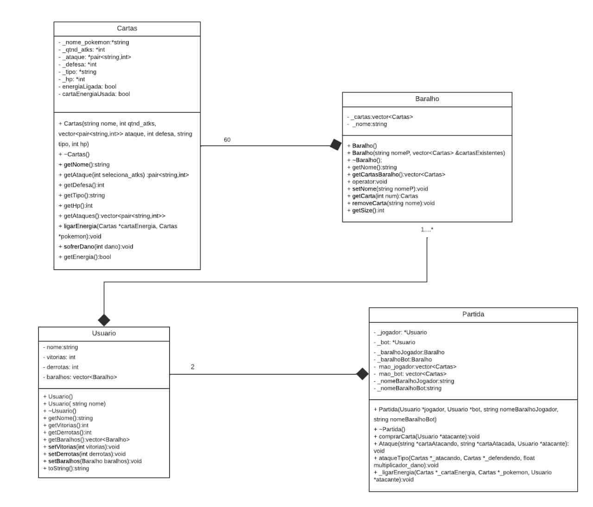

# Projeto :: Pokemon TCG

O jogo de cartas Pokémon, funciona de maneira que, dois jogadores (cada um com seu baralho, os baralhos são compostos de 60 cartas Pokémon, que contém um número de ataque, um de defesa e um de vida) entram em batalha. No início da partida os baralhos de cada um são embaralhados, e logo em seguida são retiradas 6 cartas de cada baralho e postas na mesa viradas para baixo (essas são as cartas prêmio, cada jogador tem 6 que ficam na mesa, e cada um receberá uma delas assim que ele eliminar um Pokémon inimigo). Em seguida, tira-se na moeda quem irá começar o jogo, aí são dadas 7 cartas pra cada jogador (tiradas de seus respectivos baralhos), e ambos os jogadores escolhem uma das suas 7 cartas pra começar batalhando. O jogador que venceu na moeda começa jogando, ele “come” uma carta e começa atacando, e então, compara o valor de ataque do Pokémon dele com o valor de defesa do Pokémon do oponente. E então o resultado dessa subtração é descontada na vida do Pokémon inimigo (que está sendo atacado), e segue esse ciclo. Toda vez que um Pokémon é derrotado uma das 6 cartas prêmio que ficam viradas na mesa é entregue ao jogador que derrotou o Pokémon, e isso acontece até que algum dos dois ganhe as 6 cartas.

## Funcionamento geral

Esse projeto tem como principal objetivo o gerar de uma simulação de uma partida do jogo de cartas _pokemon_. Para isso, os jogadores, definidos na classe usuários, iniciam a partida sorteando quem irá começar a jogada. Os jogadores compram uma quantidade definida de cartas dentro do monte, definido na classe baralho. Em seguida, ele coloca um Pokémon dentre esses da quantidade de cartas que possui para estar ativo no jogo, enquanto os outros ficam disponíveis caso o mesmo morra. E ao chegar na vez de cada jogador, este compra uma carta do monte, e pode atacar o oponente. Ganha o jogo, o jogador que consegue matar os Pokémon do adversário.

## Como compilar e abrir o programa ?

Depois de baixar todo o projeto em algum local do seu computador, siga os passos a seguir.

Para compilar o programa no unix devemos poder usar o comando make pelo terminal, dentro da pasta raíz, recomendamos que você procure no youtube tutorais, é importante deixar a linha "TARGET := main.exe" do arquivo Makefile como "TARGET := main". No windows, temos que ⁠instalar o mingw, ⁠⁠instalar o git, ⁠⁠navegar até a pasta raíz e executar no git bash o mingw32-make.exe, atentar também a questão da linha "TARGET := main.exe" no arquivo Makefile, que deve estar dessa forma.

Para executar em máquinas unix devemos navegar pelo terminal até a pasta raiz do projeto e executar o comando ./main para abrir o programa. Em máquinas windows devemos clicar duas vezes em cima do main.exe, localizado também dentro da pasta raíz, indo pelo explorador de arquivos do windows.

## Classes

Para que esse projeto seja funcional, realizamos a confecção de um diagrama de classes que representa cada uma das classes utilizadas no programa.

_Essas classes são divididas em Cartas, Baralho, Usuario e Partida, e elas serão explicadas a seguir_

## Cartas

A classe cartas é responsável por criar as cartas de cada tipo de Pokémon, e por isso, ela recebe os parâmetros relacionado as características desses pokémons. A classe possui também um construtor, que adiciona um “valor” a cada parâmetro, consequentemente, possui também um destrutor. Possui os métodos get e algumas funções. A função void ligarEnergia, que acessa e “liga” a energia para o Pokémon, a função void sofrerdano, no qual, intuitivamente, diz que o Pokémon sofre o dano.

#### Atributos

- string \_nome_pokemon; //Nome dado ao pokemon representado pela carta

- int \_qtnd_atks; //Quantidade de habilidades que a carta pode usar

- vector<pair<string,int>> \_ataque; //Vector que contém as habilidades das cartas

- int \_defesa; //Atributo de redução de dano tomado

- string \_tipo; //Atributo que define o multiplicador de dano

- int \_hp; //Atributo da quantidade de pontos de vida de uma carta

#### Metodos

- Cartas(string nome, int qtnd_atks, vector<pair<string,int>> ataque, int defesa, string tipo, int hp); //Construtor para a carta usa de parametros para definir o objeto

- ~Cartas(); //Destrutor, desfaz os atributos para melhor definição de cartas em uso ou não

-string getNome //Retorna o nome da carta

- pair<string,int> getAtaque(int seleciona_atks); //Retorna habilidade contida na posição do vector, indicado pelo parametro

- int getDefesa(); //Retorna valor da defesa

- string getTipo(); //Retorna tipo

- int getHp(); //Retorna valor do hp

- vector<pair<string,int>> Cartas::getAtaques(); //Retorna vector de habilidades

- void destroiCarta(); //Zera atributos da carta para o não reuso dela

- void sofrerDano(int dano); //Reduz o hp atual (\_hp - dano)

- void mostraCarta(); //Imprime o atual estado da carta

## Baralho

A classe baralho é responsável por representar baralhos de cartas Pokémon, utilizando a classe carta para formular um vector de carta associado a um nome em forma de string. Possui dois tipos de construtores, um que constrói um baralho nulo/vazio e outro que constrói um novo baralho a partir de cartas já existentes, um destrutor que limpa o nome e o vetor do baralho. Além disso possui funções get e set para receber e modificar parâmetros da classe, além de uma sobrecarga de operador que permite igualar dois objetos

#### Atributos

- vector<Cartas> \_cartas; //Vector que contém cartas que compoem o baralho

- string \_nome; //Nome do Baralho

#### Metodos

- Baralho(); //Construtor simples de baralho, faz atribuições genéricas a \_nome e \_cartas

- Baralho(string nomeP, vector<Cartas> &cartasExistentes); //Construtor parametrizado de baralho, constrói um baralho personalizado mediante ao vector de cartas

- ~Baralho(); //Destrutor de Baralho, zera os valores de vector e nome

- string getNome(); //Retorna o nome do baralho

- vector<Cartas> getCartasBaralho(); //Retorna o vector de cartas do baralho

- void setNome(string nomeP); //Altera nome do baralho
- Cartas getCarta(int num); //Retorna carta do vector, na posição de _num_

- void removeCarta(string nome); //Remove uma carta do baralho

- int getSize(); //Retorna o tamanho do baralho

## Usuario

A classe usuário, é responsável por definir os “dados” sobre o jogador, ela define o nome do usuário, a quantidade de vitórias e de derrotas. E também herda de baralho, e implementa o baralho que o mesmo possui.

#### Atributos

string nome;
int vitorias;
int derrotas;
vector<Baralho> baralhos;

#### Metodos

- Usuario();//Construtor generico para a classe

- Usuario(std::string nome);//Construtor para a classe, já atribui valores mediante ao nome

- ~Usuario(); //Destrutor da classe, desatribui valores incializados

- string getNome(); //Retorna o nome do usuario

- int getVitorias(); //Retorna o valor da quantidade de vitorias

- int getDerrotas(); //Retorna o valor da quantidade de derrotas

- vector<Baralho> getBaralhos();//Retorna o vector que contém os baralhos

- void setVitorias(int vitorias);//Aumenta em um a quantidade de vitorias

- void setDerrotas(int derrotas);//Aumenta em um a quantidade de derrotas

- void setBaralhos(Baralho baralhos);//Adiciona um baralho no vector de baralhos

- string toString();//Retorna estado do usuario em forma de string

## Partida

Essa classe gerencia o sistema de combate, todo o sistema envolvido a partir do momento em que dois jogadores entram em batalha. Ou seja, ela gerencia o embaralhamento e manuseio do baralho como a parte de “comer” uma nova carta e a de retirar uma carta da mão do jogador e a de dar uma carta prêmio, ela gerencia a mudança de rodada na alternância entre a vez de cada jogador, a comparação entre o ataque e defesa e vida do Pokémon que ataca e do que defende e etc.

#### Atributos

- Usuario \*\_jogador;//Usuario que representa o jogador

- Usuario \*\_bot;//Usuario que representa o bot

- Baralho \_baralhoJogador;//Baralho usado pelo jogador

- Baralho \_baralhoBot;//Baralho usado pelo bot

- vector<Cartas> mao_jogador;//Cartas presentes na mao do jogador

- vector<Cartas> mao_bot;//Cartas presentes na mao do bot

- string \_nomeBaralhoJogador, \_nomeBaralhoBot;//Nome do jogador e do bot

#### Metodos

- Partida(Usuario *jogador, Usuario *bot, string nomeBaralhoJogador, string nomeBaralhoBot);//Construtor parametrizado de partida, inicializa todos os valores necessarios

- ~Partida(); //Destrutor, libera valores alocados

- void comprarCarta(Usuario \*atacante);//adiciona cartas a mao do jogador

- void Ataque(string *cartaAtacando, string *cartaAtacada, Usuario \*atacante);//aplica um ataque de uma carta em outra carta

- void exibirMao(Usuario \*mao);//Imprime a mao do usuario

- void ganharPremio(string nomeJogador);//Adiciona uma carta premio ao usuario

- int numPremio(string nomeJogador);//Retorna a quantidade de cartas premio que o usuario tem

- bool estaSemCarta(string nomeJogador);//Retorna se o usuario tem ou não cartas

- void setCartaEmBatalha(int numCarta, string nomePlayer);//Coloca uma carta na batalha

- bool cartaMorta(string nomeJogador);//Retorna se a carta está morta

- void matarCarta(string nomeJogador);//Mata a carta em batalha

- vector<Cartas> getMaoJogador(string nomeJogador);//Retorna a mao do jogador

- string getNomeCartaBatalha(string nomeJogador);//Retorna o nome da carta em batalha

- void \_ligarEnergia(Cartas _\_cartaEnergia, Cartas _\_pokemon, Usuario \*atacante);//Liga a energia usada em uma habilidade
